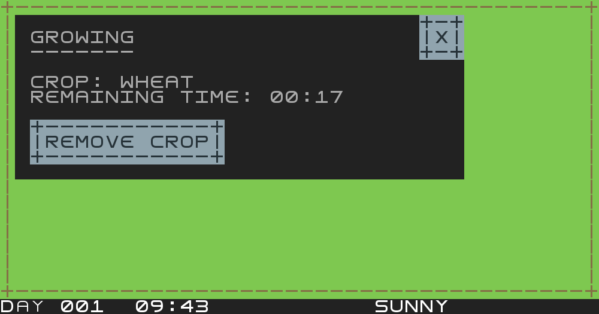
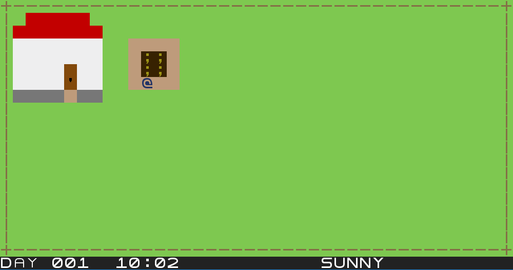
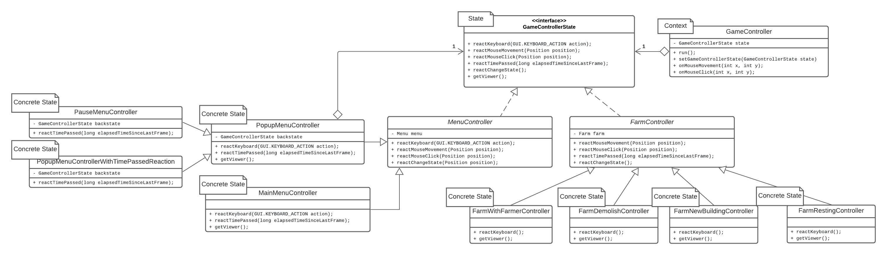
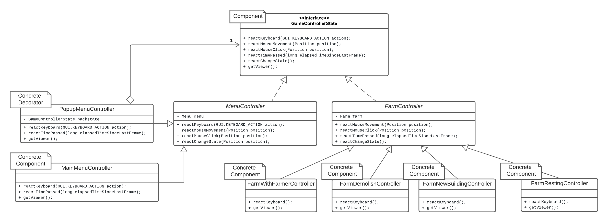
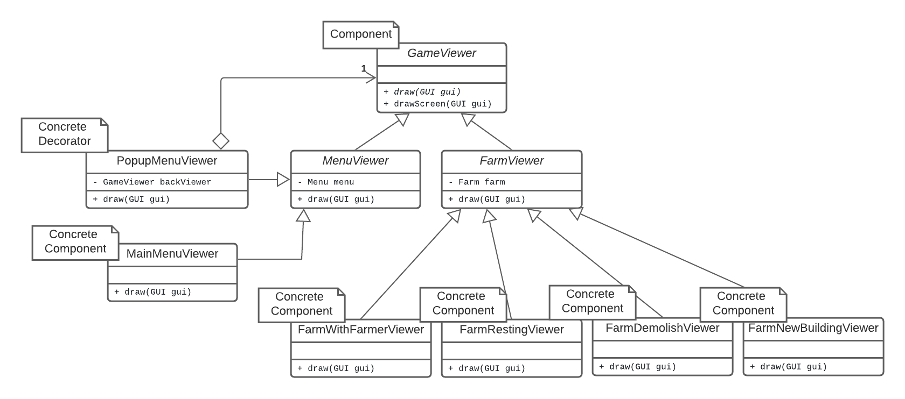
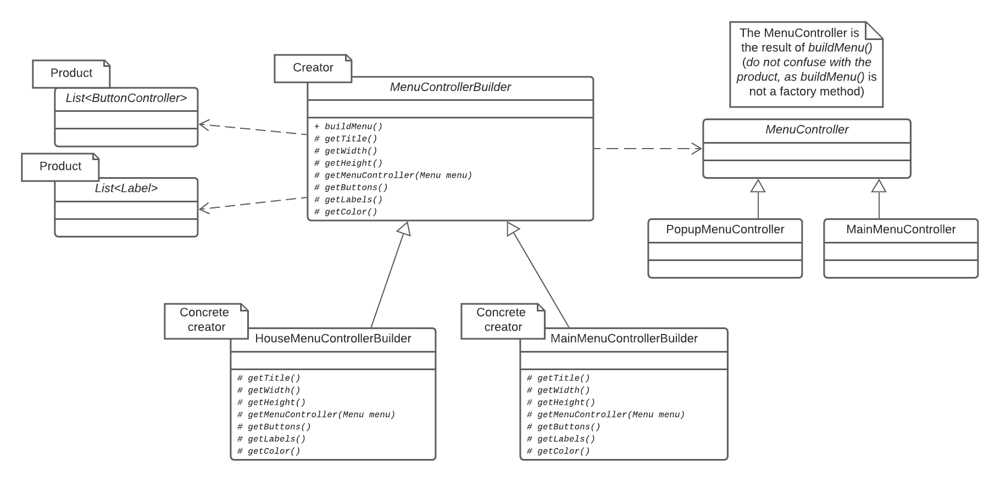
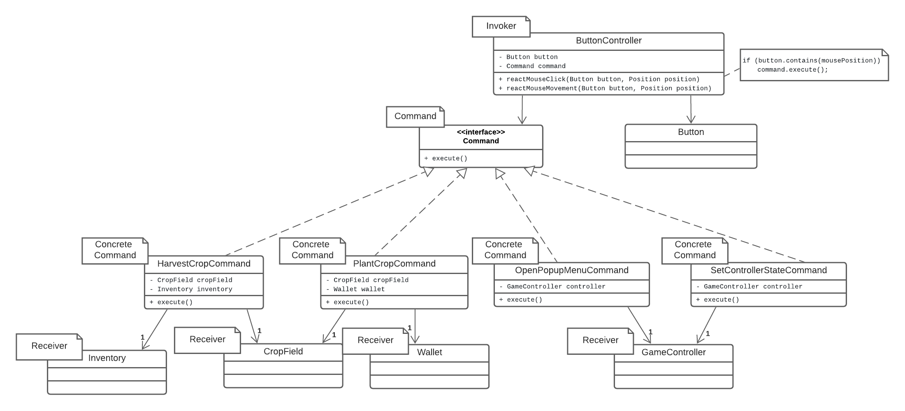
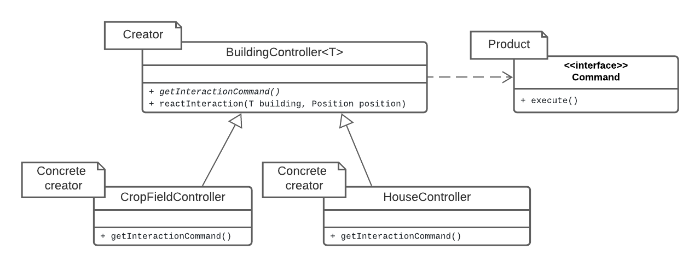
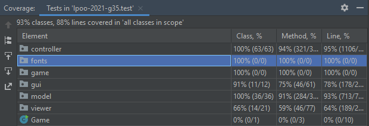

# LPOO_35 - FarmVille

FarmVille was an agriculture-simulation social network game developed and published by Zynga in 2009.

In this text-based implementation, you can manage a farm, including its crop fields and buildings.
You can also go to the market where you can buy and sell items, a house where you can rest, and a 
warehouse where your items are stored.

In this exciting new version you need to pay attention to the weather. Your fields need water to produce
but if it rains too much, or a storm comes, you might lose some or even all of your hard work.

This project was developed by Diogo Costa (up201906731@edu.fe.up.pt), Pedro Gonçalo Correia (up201905348@edu.fe.up.pt) and Rui Alves (up201905853@edu.fe.up.pt) for LPOO 2020-21.

## IMPLEMENTED FEATURES

- **Movement** - The farmer may be controlled with the WSAD keys, moving
as long as there isn't any obstacle (building or fence) obstructing his
way.
- **Interaction with crop fields** - Buildings and crop fields have light brown paths to mark
interactive positions. Pressing the SPACE bar when the farmer is in one such
position will trigger an interaction with that building (typically opening a
popup menu). For now, only crop fields have an action associated.
- **Popup Menus** - Popup menus are UI elements with labels and buttons that may be
clicked with the mouse (and are highlighted when hovered with the mouse).
These popups do not occupy the whole screen, so it is still possible to see
part of the farm. When a popup is opened, time in the farm passes as normal.
Right now, the menus implemented are used to plant, remove or harvest crops.
Note that, even though the popup menus themselves are implemented, their
automatic closing when the associated crop field changes state is not yet
implemented.
- **Crop field** - The crop field is used to plant crops. Right now, only
wheat can be planted. After planting, the crop takes some time to grow, during
which the farmer may remove the crop if he changes his mind. The gradual growth
of the crop may be seen visually when looking at the crop field, as the crops
get bigger as the harvest time is approaching. When the crop is ready to harvest
the farmer may harvest it. However, nothing will be given in return for now, as
the inventory and warehouse are not yet implemented.
- **HUD** - At the bottom of the farm screen, a HUD bar is displayed where the current
time and weather may be seen.
- **Weather** - From time to time (by random chance based on the current weather),
the weather can change, with possible weathers being sunny, cloudy, rainy,
windstorm and thunderstorm. For now, even though the weather may be seen
in the HUD bar, it has no other game effect.

### The farm with the farmer next to his home and a cropfield.

### An example of a popup menu

### A wheat crop in one of its earlier growth stages

## PLANNED FEATURES

- **More crops** - Instead of just being able to plant wheat, plant other
crops with different attributes, such as corn, tomatoes, carrots, potatoes...
- **Resting** - The farmer may enter the house to rest at any time, making
the in game time go faster so that the player doesn't have to wait so long for
the crops to grow.
- **Saving game** - The house may also be used to save the current game state,
which will be stored in a predefined file.
- **Main menu and pause menu** - When the game starts, instead of directly
opening the farm, open the main menu, where a new game may be created, if
there is currently a save, it may be loaded, and the player may exit the game.
Additionally, while in game, the player may pause the game with the ESCAPE button,
which will stop time in game and open a popup menu asking if the user wants to return
to the main menu.
- **Weather effects** - The current weather may affect the crop fields and animals
(positively or negatively). For example, a sunny weather may dry the plants, but
a windstorm may damage them.
- **Inventory and warehouse** - When the farmer harvests crops or gets products
from animals, they are stored in the warehouse. The farmer may go to the warehouse
to see the products currently stored. Be careful, however, as there is a limit
to the amount to products stored in the warehouse. It might be a good idea to
sell items before that limit is reached, because if there is not enough space
for more products, any new products obtained will be discarded.
- **Market and currency** - The market is where the farmer may go to sell the
products obtained in order to get money and to expand the farm by building more
crop fields or stockyards. Any new constructions must be placed without
intersecting existing constructions.
- **Animals** - Besides crop fields, the farm may also have stockyards. The
animals must be fed in order to produce something. For example, the farmer may
feed cows with wheat, wait some time, and then obtain milk from the cows.
- **Tools** - Some tools may be bought (and possibly upgraded) from the market
to aid the farmer in his work. There are many possible examples. A water bucket may
be filled in a fountain and used to water the plants the animals (which gives
bonuses). A hoe may be used to plow crop fields before planting crops (and thus
get a bonus). A knife may possibly be used to kill animals and get meat.
Scissors may be used to get wool from sheep.
- **Upgrades** - At the market there may be a possibility to buy upgrades
to the main buildings. Upgrading the House will make the time pass faster
while resting (it's easier to rest in a comfortable house). Upgrading the
market will increase the sell price of items and decrease the buying price.
Upgrading the warehouse will increase its capacity.

## DESIGN

### Transition between screens (for example between the game and menus)
#### Problem in Context
When applying the MVC architectural pattern, one problem that arises is
that, depending on the state of the game (for example whether a menu is opened),
different controls, views or even models may be used. Handling all those
possibilities in the GameController class would be a violation of the
**Single Responsibility Principle** and require **heavy use of conditionals** to
determine the appropriate behavior based on the context.

#### The Pattern
We have applied the State pattern. With this pattern, each possible state of
the controller is represented in a different subclass of GameControllerState.
Each concrete state controls its own behavior regarding the keyboard, the mouse
and the passage of time, and has a viewer and the relevant model associated.
The state can be set in the GameController class so that it is possible to
switch to a different state of the application by switching to another subclass.
This pattern allowed to address the identified problems because the code related
to each particular state can be separated in different classes (**Single Responsibility Principle**),
new states that may be introduced in the future can be in their own class instead of
changing the existing classes (**Open/Closed Principle**), and the heavy use of conditionals is avoided.

#### Implementation
The following diagram shows how the pattern’s roles were mapped to the application classes.

These classes can be found in the following files:
- [GameController](../src/main/java/controller/GameController.java)
- [GameControllerState](../src/main/java/controller/GameControllerState.java)
- [FarmController](../src/main/java/controller/farm/FarmController.java)
- [MenuController](../src/main/java/controller/menu/MenuController.java)
- [PopupMenuController](../src/main/java/controller/menu/PopupMenuController.java)

#### Consequences
The use of the State pattern to solve this problem has the following benefits:
- The possible states of the controller become explicit in the code, instead of relying
on flags and conditionals. The code is more organized and it is easier to navigate
to each state's logic.
- Polymorphism is used to select the correct state. New states can be added simply
by creating a new class implementing GameControllerState with the desired functionality.
- Each controller state may have its own model and viewer associated.
- If two or more states are very similar, code duplication may be avoided
using inheritance.

### Popup menus
#### Problem in Context
Some actions in the game result in a popup menu being opened. Popup menus
are a state of the controller that attaches new behavior to the previous state.
Creating a new subclass of the base state for each popup menu would lead to
**code duplication**. Adding the popup logic to the existing states
would be a violation of the **Single Responsibility Principle** and also
of the **Open/Closed Principle** as each new popup would imply modifying
the superclass.

#### The Pattern
We solved this problem with the Decorator pattern. The PopupMenuController class
is a decorator that wraps the previous state of the controller, removing its
reactions to the keyboard and mouse (but not to the passage of time) and adding its own.
This new controller has a viewer that is itself a decorator of GameViewer, which
shows the popup menu on top of the previous viewer. The popup may be closed
by setting the GameController state to the PopupMenuController's inner state.
With this pattern, the behavior of existing states was extended without making
a new subclass for each. Furthermore, the **Single Responsibility Principle**
and the **Open/Closed Principle** are conserved as this new class has the sole
responsibility of adding/removing behavior to existing classes at runtime instead  
of modifying their code directly.

#### Implementation
The following diagrams shows how the pattern’s roles were mapped to the application classes.
The first diagram shows the use of the decorator pattern in the controller. The second one
shows the use of the decorator pattern in the viewer.

These classes can be found in the following files:
- [GameController](../src/main/java/controller/GameController.java)
- [GameControllerState](../src/main/java/controller/GameControllerState.java)
- [FarmController](../src/main/java/controller/farm/FarmController.java)
- [MenuController](../src/main/java/controller/menu/MenuController.java)
- [PopupMenuController](../src/main/java/controller/menu/PopupMenuController.java)

- [GameViewer](../src/main/java/viewer/GameViewer.java)
- [FarmViewer](../src/main/java/viewer/farm/FarmViewer.java)
- [MenuViewer](../src/main/java/viewer/menu/MenuViewer.java)
- [PopupMenuViewer](../src/main/java/viewer/menu/PopupMenuViewer.java)

#### Consequences
The use of the Decorator pattern to solve this problem has the following benefits:
- New states of the controller can have popup menus using this same decorator.
- PopupMenuControllers implement GameControllerState, so they may wrap other popups.
Nesting popups may be useful in the future, for example, to open confirmation windows
inside popup menus.
However, in the case of the popup menu for a crop field in the Planted state,
if its state changes to ReadyToHarvest while the menu is open, it has no way
of knowing it, and thus will remain open even though its existence no longer
makes sense. This is not caused by oversight, but is actually a longstanding
issue that remained even after trying to think of alternatives to the implementation
design of the menus. It is not known whether it is a fundamental flaw of the
currently chosen design, however no good solution (i.e. not hacky) was found
for this problem as of the time of the delivery of the intermediate report.
This issue will be fixed after the delivery intermediate report.

### Action of the buttons
#### Problem in Context
The menus are composed of a list of buttons and labels. Each button is intended
to produce a certain action specific to that button on click. This means that
it must store in some way that action, so that the controller can execute it
when reacting to a mouse click on that button. Otherwise, there would be no
way for the controller to know how to respond to that click. One possibility
would be to delegate to each button the execution of its action, however,
as the button is part of the model, that would violate the **MVC pattern**, as the
model should just store the content of the game and not control it (thus also
violating the **Single Responsibility Principle**).

#### The Pattern
We used the Command pattern to tackle this problem. It turns each action into a
stand-alone object that contains all information about it. Each button stores a command
for which it has a setter and a getter, but it is not responsible for executing it.
There are many concrete commands executing actions on some receiver. The button
controller is responsible for retrieving and executing the command associated with
the button when it detects a click. With this pattern, the model just stores an object
without executing any action. Besides, the **Single Responsibility Principle** is also
conserved, as the invoker isn't responsible for knowing the concrete action associated
with each button, but instead it just executes the stored action, while the model is
not responsible for executing the action but instead just storing it.

#### Implementation
The following diagrams shows how the pattern’s roles were mapped to the application classes.
Only some of the commands and respective receivers were included in the diagram.

These classes can be found in the following files:
- [ButtonController](../src/main/java/controller/menu/ButtonController.java)
- [Button](../src/main/java/model/menu/Button.java)
- [Command](../src/main/java/controller/command/Command.java)
- [CompoundCommand](../src/main/java/controller/command/CompoundCommand.java)
- [HarvestCropCommand](../src/main/java/controller/command/HarvestCropCommand.java)
- [PlantCropCommand](../src/main/java/controller/command/PlantCropCommand.java)
- [OpenPopupMenuCommand](../src/main/java/controller/command/OpenPopupMenuCommand.java)
- [SetControllerStateCommand](../src/main/java/controller/command/SetControllerStateCommand.java)
- [CropField](../src/main/java/model/farm/building/crop_field/CropField.java)
- [GameController](../src/main/java/controller/GameController.java)

#### Consequences
The use of the Command pattern to solve this problem has the following benefits:
- The responsibilities of creating the action, storing the action, invoking
the action and performing the action are all separated in different classes.
This is a benefit, because those steps happen in different moments of the program
(conserves the **Single Responsibility Principle** ).
- New commands can be added without breaking existing code (**Open/Closed Principle**)
- After the command is created, its execution can be deferred until the button
is clicked.
- The commands are stand-alone objects that may be used to solve other problems
regarding generic actions other than buttons (for example, interactions between
the farmer and buildings).
There is a downside to this approach:
- Although the button doesn't have to know or execute the Command, it has to store it.
Because the Command is part of the controller and the button (part of the model) depends
on it, there is still a violation of the MVC, even though it is not as big as the one
described in the section "Problem in Context". As such, this dependency must be eliminated,
however, as of the time of the delivery of the intermediate report, it is not yet known
a good solution for refactoring. A possibility might involve having different
instances of ButtonController in a MenuController, one for each Button in the Menu,
and store the Command inside those ButtonControllers.
It also has the consequence that each different action will require a different
Command instance. This can be a negative consequence if there are too many
different needed commands.

### Some buttons execute multiple actions
#### Problem in Context
Some buttons have actions that may be divided into multiple existing
simpler actions. An example of this is when a button to plant a crop
is clicked. This button must produce the action of planting the crop
but also of closing the popup menu. Creating a different command for
every such action might lead to **code duplication** when the existing
commands could have been reused.

#### The Pattern
We used the Composite pattern to tackle this problem. A new command
CompoundCommand contains a list of commands and when executed it
executes all commands in that list in order. This allows the buttons
that need to execute complex actions to create a CompoundCommand and
add to it all the simpler commands that composes it, thus reducing
code duplication and creation of other command classes.

#### Implementation
The following diagram shows how the pattern’s roles were mapped to the application classes.

These classes can be found in the following files:
- [Command](../src/main/java/controller/command/Command.java)
- [CompoundCommand](../src/main/java/controller/command/CompoundCommand.java)
- [HarvestCropCommand](../src/main/java/controller/command/HarvestCropCommand.java)
- [SetControllerStateCommand](../src/main/java/controller/command/SetControllerStateCommand.java)

#### Consequences
The use of the Composite pattern to solve this problem has the following benefits:
- A button may store a command that is actually composed of many smaller commands
without having to know it.
- Code duplication is reduced as instead of many complex commands there is only
need to implement a set simpler ones.

### Define interaction of each building
#### Problem in Context
Each building in the game, such as the house and the crop field, may have
an interactive zone and an action associated with that interaction. The controller
of each building would then have two responsibilities: checking whether the
given position is inside the interactive zone and if so do the action of that building.
This is a violation of the **Single Responsibility Principle** and also results
in **code duplication** as each building would reuse the same logic to check if
the given position is inside the interactive zone. This would in turn result in
the **Shotgun Surgery** code smell, as if that check were to change, every building
controller would be affected.

#### The Pattern
To solve this problem we took advantage of the Command interface and applied
the Factory Method pattern. The BuildingController is an abstract class that
declares an abstract method to return a Command representing the interaction
action and implements a method to react to the interaction of a generic building.
There is a controller extending this class for each building, implementing
the abstract method to return the relevant Command.
This way, the creation of the Command is separated from its execution, as the
later requires checking whether the interaction took place at that building's
interactive zone, thus conserving the **Single Responsibility Principle**. The
**code duplication** is also avoided because that check is done in the BuildingController
class instead of being in every concrete building's controller.

#### Implementation
The following diagram shows how the pattern’s roles were mapped to the application classes.
Only some of the commands were included in the diagram.

These classes can be found in the following files:
- [BuildingController](../src/main/java/controller/farm/building/BuildingController.java)
- [Command](../src/main/java/controller/command/Command.java)
- [CropFieldController](../src/main/java/controller/farm/building/CropFieldController.java)
- [HouseController](../src/main/java/controller/farm/building/HouseController.java)

#### Consequences
The use of the Composite pattern to solve this problem has the following benefits:
- The creation of the Command and its use are not tightly coupled.
- All subclasses of BuildingController (including new ones) only need to
define its interaction command and not the logic to detect an interaction
thus preserving the **Single Responsibility Principle**.
- The Command of the interaction for each building is independent from the
others, thus preserving the **Open/Closed Principle** as new buildings can
be inserted without breaking existing code.

## KNOWN CODE SMELLS AND REFACTORING SUGGESTIONS

### Middle man

Many of the viewer classes (for example, [FarmerViewer](../src/main/java/viewer/farm/FarmerViewer.java))
are **Middle Men** as their sole purpose is to delegate the drawing work
to the respective drawer (gui) class. This adds needless complexity to the program
and also makes testing the viewers harder (if the viewer is just delegating
work to the drawer, its tests would be almost identical to the ones of the
drawer and it can't be tested isolated from the drawer).

To improve the code, for each viewer we can use **Inline Class**,
inlining the respective drawer class into the viewer class. In the concrete
example given, the draw method of [FarmerDrawer](../src/main/java/gui/drawer/entity/FarmerDrawer.java)  
would be moved to [FarmerViewer](../src/main/java/viewer/farm/FarmerViewer.java),
replacing the viewer's *draw()* method that only delegates work.
After that, [FarmerDrawer](../src/main/java/gui/drawer/entity/FarmerDrawer.java)
should be removed.

### Data class

The classes in [model.weather](../src/main/java/model/weather) and in
[model.farm.building.crop_field.crop](../src/main/java/model/farm/building/crop_field/crop)
are **Data classes** that only store constants and include getters for
those constants. These classes only bloat the code and could be replaced
with concrete instances of a single class.

A solution can be, for each of the mentioned packages, to store the relevant
constants in a file and use **Collapse Hierarchy**, merging the classes
of each of those packages into a single class. The set of concrete instances
can then be loaded from the file.

### Duplicate code

The classes in [controller.weather](../src/main/java/controller/farm/weather)
have very similar logic in their *updateWeather* methods. Besides being
**Duplicate code**, it is a **long chain of if statements** that makes it harder
to add more weathers or modify the behavior of existing ones.

To solve this problem, it is a good idea first to solve the **Data Class** code
smell identified in the previous section in the package [model.weather](../src/main/java/model/weather).
The created file that stores the constants for each weather may also store the probabilities
of weather change. This means that weather instance passed to *updateWeather*
may contain the information relative to those probabilities. Replace the chained
if statements with a for loop iterating through all probabilities and
respective weather changes. Finally, we can use **Collapse Hierarchy** to merge
all the classes in [controller.weather](../src/main/java/controller/farm/weather),
because at this point they will have identical *updateWeather* methods.

## OTHER KNOWN PROBLEMS

- The tests created for the drawer classes are actually integration tests rather
than unit tests. They will be replaced with actual unit tests after refactoring
the drawers and viewers class (see **Middle Man** section of the known code smells).

## TESTING

### COVERAGE REPORT

### [MUTATION TESTING REPORT](../build/reports/pitest)

## SELF-EVALUATION

- Diogo Costa: 33%
- Pedro Gonçalo Correia: 34%
- Rui Alves: 33%
