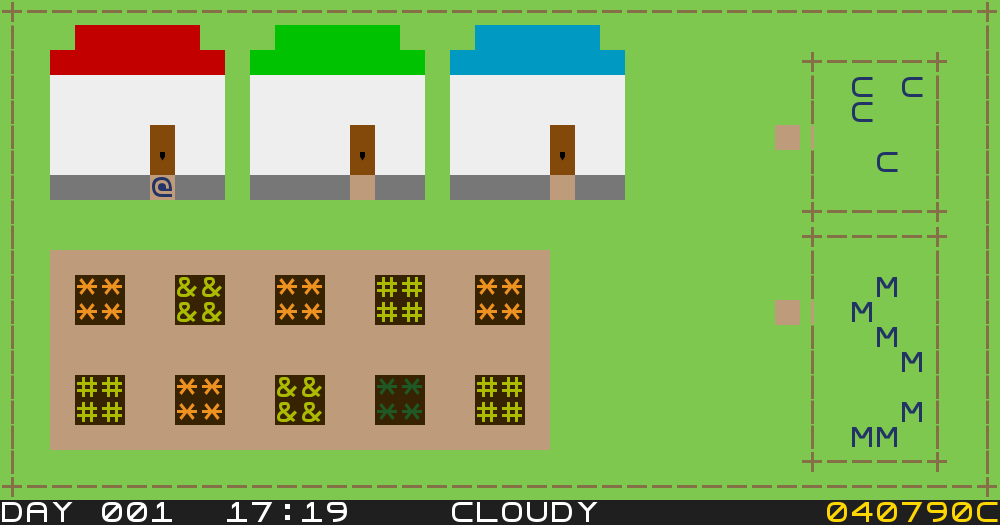
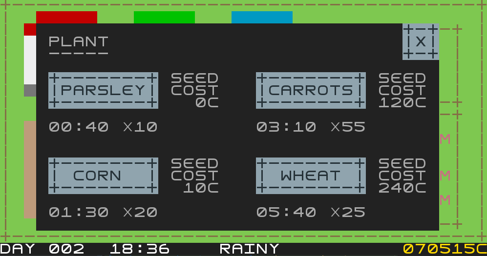
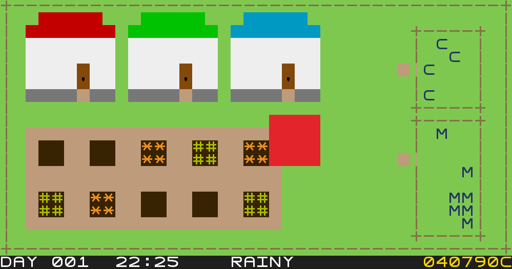
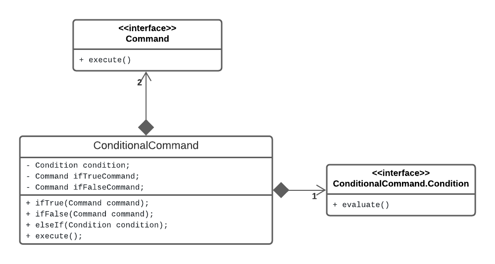
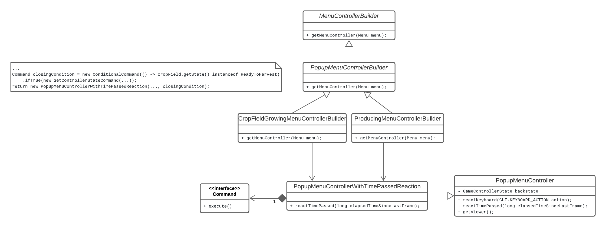
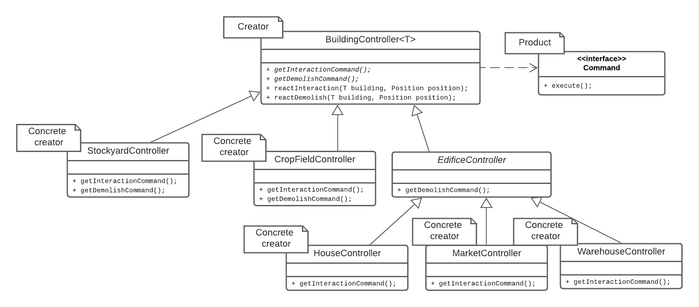

# LPOO_35 - FarmVille

FarmVille was an agriculture-simulation social network game developed and published by Zynga in 2009.

In this text-based implementation, you can manage a farm, including its cropfields and stockyards.
You can also go to the market where you can buy and sell items, a house where you can rest or save
the game, and a warehouse where your items are stored.

In this exciting new version you need to pay attention to the weather! Rain is beneficial for your
crops and animals, but if a storm comes, or there is too much sun, you might lose some or even all
of your hard work.

This project was developed by Diogo Costa (up201906731@edu.fe.up.pt), Pedro Gonçalo Correia (up201905348@edu.fe.up.pt)
and Rui Alves (up201905853@edu.fe.up.pt) for LPOO 2020-21.

## IMPLEMENTED FEATURES

- **Movement** - The farmer may be controlled with the WSAD keys, moving
as long as there isn't any obstacle obstructing his way and he is inside the
playable region.
- **Interaction with buildings** - Edifices, crop fields and stockyards
have light brown paths to mark interactive positions. Pressing the SPACE
bar when the farmer is in one such position will trigger an interaction
with that building (typically opening a popup menu).
- **Crop fields** - The crop field is used to plant crops. After planting,
the crop takes some time to grow, during which the farmer can remove the crop
if he changes his mind. The crop's type and its gradual growth can be seen visually when
looking at the crop field: the crops grow as the harvest time is approaching.
When the crop is ready to harvest the farmer may harvest it.
- **Crops** - The farmer is able to plant several types of crops: parsley, corn,
carrots and wheat. Each has different seed prices to be planted, base harvest amounts
and required time to grow.
- **Stockyards and animals** - Besides crop fields, the farm may also have stockyards. The
animals must be fed in order to produce something. For example, the farmer may
feed cows with wheat, wait some time, and then obtain milk from the cows. In the case
of chickens, they are fed with corn, and after some time they produce eggs.
In each stockyard, animals can be bought up to a given amount. More animals means
more production, however, it also means more food to feed the animals. If there are too
many animals, it may become too hard to harvest the required food. In that case,
it might be worth considering selling some animals.
- **Weather** - From time to time (by random chance based on the current weather),
the weather can change, with possible weathers being sunny, cloudy, rainy,
windstorm and thunderstorm. The current weather affects the crop fields and animals
(positively or negatively). For example, a sunny weather will dry the plants and
wear out the animals, and a windstorm may damage your harvest and production. On
the other hand, rain is beneficial for your farm. Yet, after the plant is ready to
harvest (or the animal product is ready to collect), even beneficial weathers will
make them rot over time, instead of boosting them: it is important to harvest and
collect as soon as possible!
- **HUD** - At the bottom of the farm screen, a HUD bar is displayed where the current
time, weather and your money may be seen.
- **Resting** - The farmer may enter the house to rest at any time, making
the in game time go faster so that the player doesn't have to wait so long for
the crops to grow or the animals to produce.
- **Saving and loading game** - The house may also be used to save the current game state,
which will be stored in a file to be loaded at a later time.
**Popup Menus** - Popup menus are UI elements with labels and buttons that may be
clicked with the mouse (and are highlighted when hovered with the mouse).
These popups do not occupy the whole screen, so it is still possible to see
part of the farm behind it. While a popup is opened, time in the farm passes as normal,
unless it is the pause menu. However, the farmer or any menus behind it cannot be moved
until that menu is closed.
- **Main menu and pause menu** - When the game starts, instead of directly
opening the farm, the main menu is opened, where a new game may be started. If
there is currently a save file, it can loaded instead. There is also a button to exit the game.
Additionally, while in game, the player may pause the game with the ESCAPE button,
which will stop time in game and open a popup menu asking if the user wants to return
to the main menu.
- **Inventory and warehouse** - When the farmer harvests crops or gets products
from animals, they are stored in the warehouse. The farmer may go to the warehouse
to see the products currently stored. Be careful, however, as there is a limit
to the amount to products stored in the warehouse. It might be a good idea to
sell items before that limit is reached, because if there is not enough space
for more products, any new products obtained will be discarded.
- **Market and currency** - The market is where the farmer may go to sell the
products obtained in order to get money. It's also the place to build new crop fields
or stockyards. Any new constructions must be placed without intersecting existing
constructions. Furthermore, it is possible to demolish existing stockyards or crop fields
(as long as one crop field always remains in the farm). While there is a cost to build,
there is no cost (nor return) to demolish.

### Farm overview

### The crop field plant menu

### Farmer trying to build a new crop field in an invalid position

## PLANNED FEATURES

- **Tools** - Tools may be bought (and possibly upgraded) from the market
to aid the farmer in his work. There are many possible examples. A water bucket may
be filled in a fountain and used to water the plants the animals (which gives harvest
and collect bonuses). A hoe may be used to plow crop fields before planting crops (and thus
get a harvest bonus). A knife may possibly be used to kill animals and get meat.
- **Upgrades** - At the market there may be a possibility to buy upgrades
to the main edifices. Upgrading the House will make the time pass faster
while resting (it's easier to rest in a comfortable house). Upgrading the
market will increase the sell price of items and decrease the building price
and upgrade price (for tools and edifices). Upgrading the warehouse will increase its capacity.

## DESIGN

### Transition between screens (for example between the game and menus)
#### Problem in Context
When applying the MVC architectural pattern, one problem that arises is
that, depending on the state of the game (for example whether a menu is opened),
different controls, views or even models may be used. Handling all those
possibilities in the GameController class would be a violation of the
**Single Responsibility Principle** and require **heavy use of conditionals** to
determine the appropriate behavior based on the context.
Moreover, many of the states are similar: there are only two big different types
of states (menus and farm) but many variants of each. For example in the farm the
player may be controlling the farmer, resting, controlling the demolition marker
or (when building) the new building position. The menu might be a popup menu or
the main menu.

#### The Pattern
We have applied the State pattern. With this pattern, each possible state of
the controller is represented in a different subclass of GameControllerState.
Each concrete state controls its own behavior regarding the keyboard, the mouse
and the passage of time, and has a viewer and the relevant model associated.
The state can be set in the GameController class so that it is possible to
switch to a different state of the application by switching to another subclass.
This pattern allowed to address the identified problems because the code related
to each particular state can be separated in different classes (**Single Responsibility Principle**),
new states that may be introduced in the future can be in their own class instead of
changing the existing classes (**Open/Closed Principle**), and the heavy use of conditionals is avoided.

#### Implementation
In order to handle similar variants of the states, two abstract state classes
where created implementing GameControllerState: FarmController and MenuController. Each
has concrete subclasses for each of the possible variants.

The following diagram shows how the pattern’s roles were mapped to the application classes.

These classes can be found in the following files:
- [GameController](../src/main/java/controller/GameController.java)
- [GameControllerState](../src/main/java/controller/GameControllerState.java)
- [MenuController](../src/main/java/controller/menu/MenuController.java)
- [MainMenuController](../src/main/java/controller/menu/MainMenuController.java)
- [PopupMenuController](../src/main/java/controller/menu/PopupMenuController.java)
- [PauseMenuController](../src/main/java/controller/menu/PauseMenuController.java)
- [PopupMenuControllerWithTimePassedReaction](../src/main/java/controller/menu/PopupMenuControllerWithTimePassedReaction.java)
- [FarmController](../src/main/java/controller/farm/FarmController.java)
- [FarmWithFarmerController](../src/main/java/controller/farm/FarmWithFarmerController.java)
- [FarmDemolishController](../src/main/java/controller/farm/FarmDemolishController.java)
- [FarmNewBuildingController](../src/main/java/controller/farm/FarmNewBuildingController.java)
- [FarmRestingController](../src/main/java/controller/farm/FarmRestingController.java)

#### Consequences
The use of the State pattern to solve this problem has the following benefits:
- The possible states of the controller become explicit in the code, instead of relying
on flags and conditionals. The code is more organized and it is easier to navigate
to each state's logic.
- Polymorphism is used to select the correct state. New states can be added simply
by creating a new class implementing GameControllerState with the desired functionality.
- Each controller state may have its own model and viewer associated.
- If two or more states are very similar, code duplication may be avoided
using inheritance.

### Popup menus
#### Problem in Context
Some actions in the game result in a popup menu being opened. Popup menus
are a state of the controller that attaches new behavior to the previous state.
Creating a new subclass of the base state for each popup menu would lead to
**code duplication**. Adding the popup logic to the existing states
would be a violation of the **Single Responsibility Principle** and also
of the **Open/Closed Principle** as each new popup would imply modifying
the superclass.

#### The Pattern
We solved this problem with the Decorator pattern. The PopupMenuController class
is a decorator that wraps the previous state of the controller, removing its
reactions to the keyboard and mouse (but not to the passage of time) and adding its own.
This new controller has a viewer that is itself a decorator of GameViewer (the base viewer class),
showing the popup menu on top of the previous viewer. The popup may be closed
by setting the GameController state to the PopupMenuController's inner state.
With this pattern, the behavior of existing states was extended without making
a new subclass for each. Furthermore, the **Single Responsibility Principle**
and the **Open/Closed Principle** are conserved as this new class has the sole
responsibility of adding/removing behavior to existing classes at runtime instead 
of modifying their code directly.

#### Implementation
Like in the case of the controllers, there are two abstract classes for the two
different types of viewer states, and each concrete viewer state is a subclass of one of the two.

The following diagrams shows how the pattern’s roles were mapped to the application classes.
The first diagram shows the use of the decorator pattern in the controller. The second one
shows the use of the decorator pattern in the viewer.

These classes can be found in the following files:
- [GameControllerState](../src/main/java/controller/GameControllerState.java)
- [MenuController](../src/main/java/controller/menu/MenuController.java)
- [MainMenuController](../src/main/java/controller/menu/MainMenuController.java)
- [PopupMenuController](../src/main/java/controller/menu/PopupMenuController.java)
- [FarmController](../src/main/java/controller/farm/FarmController.java)
- [FarmWithFarmerController](../src/main/java/controller/farm/FarmWithFarmerController.java)
- [FarmDemolishController](../src/main/java/controller/farm/FarmDemolishController.java)
- [FarmNewBuildingController](../src/main/java/controller/farm/FarmNewBuildingController.java)
- [FarmRestingController](../src/main/java/controller/farm/FarmRestingController.java)

- [GameViewer](../src/main/java/viewer/GameViewer.java)
- [MenuViewer](../src/main/java/viewer/menu/MenuViewer.java)
- [MainMenuViewer](../src/main/java/viewer/menu/MainMenuViewer.java)
- [PopupMenuViewer](../src/main/java/viewer/menu/PopupMenuViewer.java)
- [FarmViewer](../src/main/java/viewer/farm/FarmViewer.java)
- [FarmWithFarmerViewer](../src/main/java/viewer/farm/FarmWithFarmerViewer.java)
- [FarmRestingViewer](../src/main/java/viewer/farm/FarmRestingViewer.java)
- [FarmDemolishViewer](../src/main/java/viewer/farm/FarmDemolishViewer.java)
- [FarmNewBuildingViewer](../src/main/java/viewer/farm/FarmNewBuildingViewer.java)

#### Consequences
The use of the Decorator pattern to solve this problem has the following benefits:
- New states of the controller can have popup menus using this same decorator.
- PopupMenuControllers implement GameControllerState, so they may wrap other popups.
Nesting popups is in itself very useful as it allows, for example, the use of 
confirmation windows inside popup menus.

### Create many different menus
#### Problem in Context
In the game there are many different menus, with different sizes, buttons and
labels. It is important to be able to generate them without too much code duplication.
In order to conserve the **Single Responsibility Principle**, it is also important
to separate the creation of each menu from the menu controller and model themselves.

#### The Pattern
We created an abstract class [MenuControllerBuilder](../src/main/java/controller/menu/builder/MenuControllerBuilder.java)  
based on **Factory Method** to build the menus. This class is responsible for
building a menu and declares several factory methods (to get the menu width, height,
buttons, labels, etc.) to be implemented in subclasses.

Each concrete creator implements those methods, returning the properties of the
menu they are responsible to create. The **Single Responsibility Principle** is
thus conserved, as the definition of the properties and the creation of the menu are
separated. New menus can be easily implemented without changing existing ones, thus
conserving the **Open/Closed Principle**. New menus may extend existing ones by subclassing them,
however, they should never remove buttons or labels from their superclass so that they are
extending their functionality instead of changing it. For that, the respective factory methods
always call the respective *super*class method before adding the new buttons/labels.

#### Implementation
The following diagram shows how the pattern’s roles were mapped to the application classes.
Because there is a very large number of menu builders, menu controllers and products, only some were included
in the diagram for brevity. The return of each factory method (all protected methods in the diagram are
factory methods) is a product.

These classes can be found in the following files:
- [GameControllerState](../src/main/java/controller/GameControllerState.java)
- [MenuController](../src/main/java/controller/menu/MenuController.java)
- [MainMenuController](../src/main/java/controller/menu/MainMenuController.java)
- [PopupMenuController](../src/main/java/controller/menu/PopupMenuController.java)
- [FarmController](../src/main/java/controller/farm/FarmController.java)
- [FarmWithFarmerController](../src/main/java/controller/farm/FarmWithFarmerController.java)
- [FarmDemolishController](../src/main/java/controller/farm/FarmDemolishController.java)
- [FarmNewBuildingController](../src/main/java/controller/farm/FarmNewBuildingController.java)
- [FarmRestingController](../src/main/java/controller/farm/FarmRestingController.java)

#### Consequences
This approach has the following benefits:
- The definition of the properties of the menu and its creation are separated, thus conserving
the **Single Responsibility Principle**.
- New menu builders may be added without changing existing builders, thus conserving the
**Open/Closed Principle**.
- Menus may reuse buttons and properties by inheriting from more generic builders.

### Action of the buttons
#### Problem in Context
The menus are composed of a list of buttons and labels. Each button is intended
to produce a certain action specific to that button on click. This means that
it must store in some way that action, so that the controller can execute it
when reacting to a mouse click on that button. Otherwise, there would be no
way for the controller to know how to respond to that click. One possibility
would be to delegate to each button the execution of its action, however,
as the button is part of the model, that would violate the **MVC pattern**, as the
model should just store the content of the game and not control it (thus also
violating the **Single Responsibility Principle**).

#### The Pattern
We used the Command pattern to tackle this problem. It turns each action into a
stand-alone object that contains all information about it. Each button controller stores a command
and executes it when it detects a click in the respective button.
There are many concrete commands executing actions on some receiver. With this pattern, the model
does not know anything about the command or the controller, thus not violating the **MVC pattern**.
Besides, the **Single Responsibility Principle** is also conserved, as the invoker isn't responsible
for knowing the concrete action associated with the button, but instead it just executes the stored action
when it is clicked.

#### Implementation
The following diagrams shows how the pattern’s roles were mapped to the application classes.
Because there is a very large number of commands, only some of the commands and respective
receivers were included in the diagram.
The clients are typically subclasses of [MenuControllerBuilder](../src/main/java/controller/menu/builder/MenuControllerBuilder.java),
but were not included in the diagram for more simplicity.

These classes can be found in the following files:
- [ButtonController](../src/main/java/controller/menu/element/ButtonController.java)
- [Button](../src/main/java/model/menu/Button.java)
- [Command](../src/main/java/controller/command/Command.java)
- [HarvestCropCommand](../src/main/java/controller/command/farm/crop_field/HarvestCropCommand.java)
- [PlantCropCommand](../src/main/java/controller/command/farm/crop_field/PlantCropCommand.java)
- [OpenPopupMenuCommand](../src/main/java/controller/command/controller_state/OpenPopupMenuCommand.java)
- [SetControllerStateCommand](../src/main/java/controller/command/controller_state/SetControllerStateCommand.java)
- [Inventory](../src/main/java/model/farm/Inventory.java)
- [CropField](../src/main/java/model/farm/building/crop_field/CropField.java)
- [Wallet](../src/main/java/model/farm/Wallet.java)
- [GameController](../src/main/java/controller/GameController.java)

#### Consequences
The use of the Command pattern to solve this problem has the following benefits:
- The responsibilities of creating the action (e.g. menu builder), invoking
the action (button controller) and performing the action (command) are all separated in different classes.
This is a benefit, because those steps happen in different moments of the program
(conserves the **Single Responsibility Principle**).
- New commands can be added without breaking existing code (**Open/Closed Principle**)
- After the command is created, its execution can be deferred until the button
is clicked.
- The commands are stand-alone objects that may be used to solve other problems
regarding generic actions other than buttons (for example, interactions between
the farmer and buildings).

### Some buttons execute multiple actions
#### Problem in Context
Some buttons have actions that may be divided into multiple existing
simpler actions. An example of this is when a button to plant a crop
is clicked. This button must produce the action of planting the crop
but also of closing the popup menu. Creating a different command for
every such action might lead to **code duplication** when the existing
commands could have been reused.

#### The Pattern
We used the Composite pattern to tackle this problem. A new command
CompoundCommand contains a list of commands and when executed it
executes all commands in that list in order. This allows the buttons
that need to execute complex actions to create a CompoundCommand and
add to it all the simpler commands that composes it, thus reducing
code duplication and creation of other command classes.

#### Implementation
The following diagram shows how the pattern’s roles were mapped to the application classes.

These classes can be found in the following files:
- [Command](../src/main/java/controller/command/Command.java)
- [CompoundCommand](../src/main/java/controller/command/CompoundCommand.java)
- [HarvestCropCommand](../src/main/java/controller/command/farm/crop_field/HarvestCropCommand.java)
- [SetControllerStateCommand](../src/main/java/controller/command/controller_state/SetControllerStateCommand.java)

#### Consequences
The use of the Composite pattern to solve this problem has the following benefits:
- A ButtonController may store a command that is actually composed of many smaller commands
without having to know it.
- Code duplication is reduced as instead of many complex commands there is only
need to implement a set of simpler ones.

### Some buttons actions depends on conditions
#### Problem in Context
Some buttons must execute different actions depending on some condition.
For example, the FEED button in the stockyard menu when the animals are not producing
must execute the [FeedAnimalsCommand](../src/main/java/controller/command/farm/stockyard/FeedAnimalsCommand.java)
if there is enough food in the inventory, or open an alert popup otherwise (or when
there is no animal in the stockyard). Moreover, this condition should not be evaluated
when building the menu, as it can change later (for example, the user may buy an animal
in the same menu, thus becoming able to feed them).

#### The Solution

In order to solve this problem, we implemented a [ConditionalCommand](../src/main/java/controller/command/ConditionalCommand.java)
which receives a condition and may set a command to execute when the condition is true
and another to execute when the condition is false. The command only evaluates the condition
when executed.
To ease the creation of instances of this command, it is implemented with a **fluent builder pattern**
design in mind. Its setters return the instance itself. There is also a method *elseIf()* which receives
a condition and creates another instance of ConditionalCommand, nesting it in the *ifFalseCommand* of the
current one, and returns the new one. This way, "else if" conditions can be added in a easy to read way,
while keeping the structure of the code flat.

#### Implementation
The following diagram shows the relevant classes in the solution of this problem.

These classes can be found in the following files:

- [Command](../src/main/java/controller/command/Command.java)
- [ConditionalCommand](../src/main/java/controller/command/ConditionalCommand.java)

#### Consequences
This solution has the following benefits:
- This solution allows the condition to be evaluated lazily, at the time of the execution of the command,
thus there is no risk of changing between the evaluation and the execution.
- This solution allows to reuse existing simpler commands to create more complex commands with conditions,
thus helping in reducing code duplication.
- The setters and *elseIf()* methods allow creating instances of this class in a easy to read way, without
losing too much of the readability of traditional if statements.

### Switching menu when ready to harvest
#### Problem in Context
After designing the Popup menus and the respective builders as described
previously in the report, one problem that remained was that the menu
shown when interacting with a crop field while a crop is growing should switch
to the harvesting menu when that crop is ready to harvest. At the
[time of the intermediate delivery of the project](https://github.com/FEUP-LPOO-2021/lpoo-2021-g35/blob/339e1591dcd5b80f1ded20a2c2dc974649c64b4d/src/main/java/controller/menu/builder/MenuBuilder.java#L6),
menu builders did not build controllers and could only define their buttons and labels, width and height, and title,
so there was no way for the menu to check without user input if the crop is ready to harvest.
This meant that the menu would remain in the growing state after the remaining time to
grow reached zero.

#### The Solution and implementation
After trying to come up with design solutions or alternatives and trying to
identify the root issue with the design at the time, the decided solution
was to create a subclass of PopupMenuController specifically to extend it with
a reaction to the passage of time. This class receives a Command in its constructor
to determine what should happen when time passes. The menu builders have a method
that returns the [MenuController they intend to build](https://github.com/FEUP-LPOO-2021/lpoo-2021-g35/blob/c7c8fce742210b7ae9c4fe0508f1a2dbcb820425/src/main/java/controller/menu/builder/MenuControllerBuilder.java#L53)
so by overriding this method, the [CropFieldGrowingMenuControllerBuilder](../src/main/java/controller/menu/builder/building/crop_field/CropFieldGrowingMenuControllerBuilder.java)
and the [ProducingMenuControllerBuilder](../src/main/java/controller/menu/builder/building/stockyard/ProducingMenuControllerBuilder.java)
can create an instance of this subclass of PopupMenuController, adding a command
that checks if the crop or product is ready and switches the menu if that's the case.

The following diagram shows the relevant classes in the solution of this problem.

These classes can be found in the following files:

- [MenuControllerBuilder](../src/main/java/controller/menu/builder/MenuControllerBuilder.java)
- [PopupMenuControllerBuilder](../src/main/java/controller/menu/builder/PopupMenuControllerBuilder.java)
- [CropFieldGrowingMenuControllerBuilder](../src/main/java/controller/menu/builder/building/crop_field/CropFieldGrowingMenuControllerBuilder.java)
- [ProducingMenuControllerBuilder](../src/main/java/controller/menu/builder/building/stockyard/ProducingMenuControllerBuilder.java)
- [Command](../src/main/java/controller/command/Command.java)
- [PopupMenuController](../src/main/java/controller/menu/PopupMenuController.java)
- [PopupMenuControllerWithTimePassedReaction](../src/main/java/controller/menu/PopupMenuControllerWithTimePassedReaction.java)

#### Consequences
- This solution is generic enough that it can be applied both to the crop fields and to the stockyards,
as well as other menus that might need in the future to execute an action or check periodically.
- However, this solution creates a new subclass of PopupMenuController for a very specific reason
and forces menu builders to know and decide the menu controller they will create.

### Define interaction of each building
#### Problem in Context
Each building in the game, such as the house and the crop field, may have
an interactive zone and an action associated with that interaction. The controller
of each building would then have two responsibilities: checking whether the
given position is inside the interactive zone and if so do the action of that building.
This is a violation of the **Single Responsibility Principle** and also results
in **code duplication** as each building would reuse the same logic to check if
the given position is inside the interactive zone. This would in turn result in
the **Shotgun Surgery** code smell, as if that check were to change, every building
controller would be affected.

#### The Pattern
To solve this problem we took advantage of the Command interface and applied
the Factory Method pattern. The BuildingController is an abstract class that
declares an abstract method to return a Command representing the interaction
action and implements a method to react to the interaction of a generic building.
There is a controller extending this class for each building, implementing
the abstract method to return the relevant Command.
This way, the creation of the Command is separated from its execution, as the
later requires checking whether the interaction took place at that building's
interactive zone, thus conserving the **Single Responsibility Principle**. The
**code duplication** is also avoided because that check is done in the BuildingController
class instead of being in every concrete building's controller.
This design was also applied to the case of demolishing buildings, as the mechanism is
very similar.

#### Implementation
Because the house, market and warehouse have the same demolish reaction, their respective
controllers are subclasses of EdificeController, which implements the *getDemolishCommand()*
method.

The following diagram shows how the pattern’s roles were mapped to the application classes.

These classes can be found in the following files:
- [BuildingController](../src/main/java/controller/farm/element/building/BuildingController.java)
- [Command](../src/main/java/controller/command/Command.java)
- [CropFieldController](../src/main/java/controller/farm/element/building/CropFieldController.java)
- [StockyardController](../src/main/java/controller/farm/element/building/StockyardController.java)
- [EdificeController](../src/main/java/controller/farm/element/building/edifice/EdificeController.java)
- [HouseController](../src/main/java/controller/farm/element/building/edifice/HouseController.java)
- [MarketController](../src/main/java/controller/farm/element/building/edifice/MarketController.java)
- [WarehouseController](../src/main/java/controller/farm/element/building/edifice/WarehouseController.java)

#### Consequences
The use of the Factory Method pattern to solve this problem has the following benefits:
- The creation of the Command and its use are not tightly coupled.
- All subclasses of BuildingController (including new ones) only need to
define its interaction commands and not the logic to detect an interaction
thus preserving the **Single Responsibility Principle**.
- The Command of the interaction for each building is independent from the
others, thus preserving the **Open/Closed Principle** as new buildings can
be inserted without breaking existing code.

## KNOWN CODE SMELLS AND REFACTORING SUGGESTIONS

## SOLVED CODE SMELLS
### Middle man

Many of the viewer classes (for example, [FarmerViewer](../src/main/java/viewer/farm/element/entity/FarmerViewer.java))
were **Middle Men** as their sole purpose was to delegate the drawing work
to the respective drawer (gui) class. This added needless complexity to the program
and also made testing the viewers harder (if the viewer is just delegating
work to the drawer, its tests would be almost identical to the ones of the
drawer and it couldn't be tested isolated from the drawer).
//TODO isto continua a ser verdade :(

To improve the code, we used the **Inline Class** refactor,
inlining the respective drawer class into the viewer class. In the concrete
example given, the draw method of FarmerDrawer was moved to 
[FarmerViewer](../src/main/java/viewer/farm/element/entity/FarmerViewer.java),
replacing the viewer's *draw()* method that only delegated work.
After that, FarmerDrawer was removed.

### Data class

The classes that were in model.weather and in model.farm.crop
were **Data classes** that only stored constants and included getters for
those constants. These classes only bloated the code and were replaced
with concrete instances of a single class.

The solution was, for each of the mentioned packages, to store the relevant
constants in a file and use **Collapse Hierarchy**, merging the classes
of each of those packages into a single class. The set of concrete instances
was then loaded from the file.

### Duplicate code

The classes that were in controller.weather.state had very similar logic in their 
*updateWeather* methods. Besides being **Duplicate code**, it was a 
**long chain of if statements** that made it harder
to add more weathers or modify the behavior of existing ones.

To solve this problem, we first solved the **Data Class** code
smell identified in the previous section in the package model.weather.
The created file that stores the constants for each weather also stores the probabilities
of weather change. This means that the weather instance passed to *updateWeather*
contains the information relative to those probabilities. The chained
if statements were replaced with a for loop iterating through all probabilities and
respective weather changes. Then, we used **Collapse Hierarchy** to merge
all the classes in controller.weather.state, because at that point they had 
identical *updateWeather* methods. Finally, the resulting class was inlined 
in [WeatherController](../src/main/java/controller/farm/element/WeatherController.java)
because it no longer made sense to have a state and thus both classes had the
same responsibility.

## TESTING

### COVERAGE REPORT

### [MUTATION TESTING REPORT](../build/reports/pitest)

## SELF-EVALUATION

- Diogo Costa: 33%
- Pedro Gonçalo Correia: 37%
- Rui Alves: 30%
